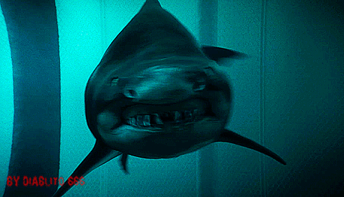
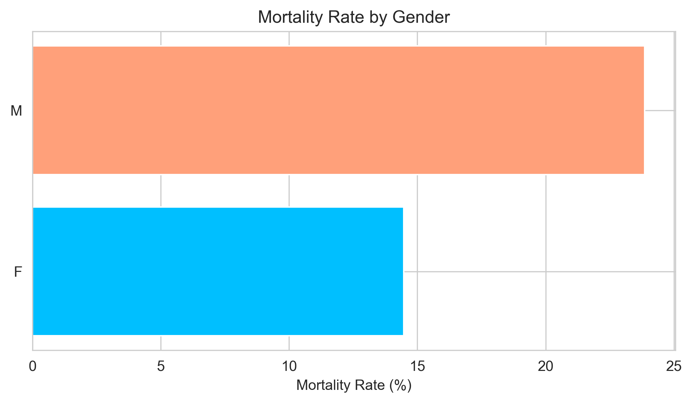
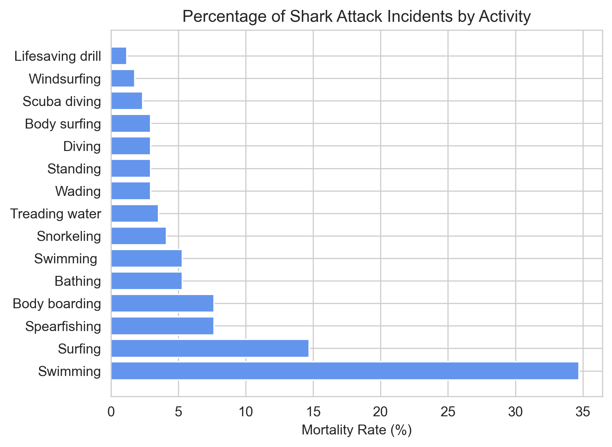
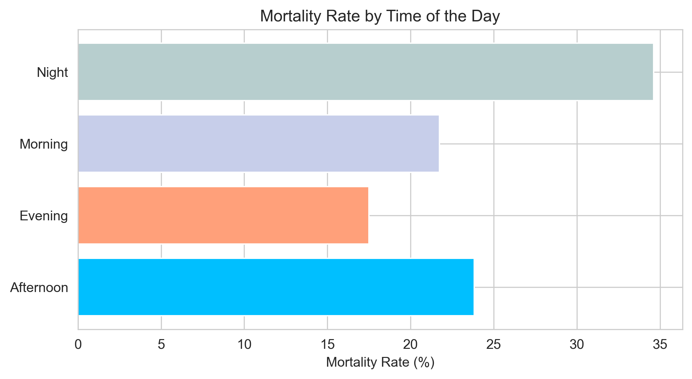

# PROJECT SHARK

En el siguiente proyecto realizado en Ironhack, podremos encontrar un análisis de un data set sobre ataques de tiburones. https://www.sharks.org/global-shark-attack-file.

## Data Cleaning

Para realizar el análisis de este documento, primero tuvimos que importar el archivo CSV en un notebook para empezar el proceso de limpieza de datos que no nos servian de nada para las hipotesis seleccionadas.Cambiamos el nombre de las columnas, eliminamos espacios y las convertimos en lowercase para facilitar su tratamiento, nos quedamos solo con cuatro columnas de las cuales eliminamos los valores NaN y los valores que no nos interesaban o no consideramos necesarios, y convertimos estos valores en formatos iguales o más cohesivos para facilitar un análisis más simple y coherente. Todo esto lo podemos encontrar en el archivo clean.ipynb

## Data analysis

Este análisis ha permitido calcular la mortalidad de los ataques de tiburón en función de tres variables clave: el género de la víctima, la actividad que se estaba practicando en el momento del ataque y la franja horaria en la que se produjo. Para presentar de manera clara y concisa los resultados obtenidos, hemos creado tablas que sintetizan la información y permiten una fácil interpretación de los datos. A continuación, presentaremos las principales hipótesis y conclusiones obtenidas.

## Hipótesis

### Hipótesis 1

**La tasa de mortalidad de los hombres víctimas de ataques de tiburones es claramente mayor que la de las víctimas femeninas.**

Los datos nos muestran que los ataques de tiburón a individuos de género masculino son notoriamente más letales que los que sufren las mujeres.   

### Hipótesis 2

**No se puede establecer una relación clara entre la actividad practicada y las posibilidades de que el ataque sea mortal**

Los resultados obtenidos indican que la mayoría de las víctimas mortales de ataques de tiburón se encontraban realizando actividades relacionadas con la natación o el surf en el momento del ataque, por lo que si se puede establecer cierta relación.

### Hipótesis 3

**El momento del día influye claramente en la fatalidad del ataque**

Los resultados del análisis realizado nos muestran que los ataques sufridos de noche (de 21:00 a 04:00h) son más mortales que los que ocurren en otras franjas horarias. Los ataques que ocurren durante el mediodia (de 12:00 a 17:00h) también son levemente más letales que en otras franjas, no obstante la tasa de mortalidad no es tan pronunciadamente alta como en los ataques nocturnos.

## Conclusiones

La conclusión principal que podemos sacar de este pequeño análisis es que si te identificas como hombre, lo mejor es que no salgas a nadar o surfear, especialmente por la noche...

